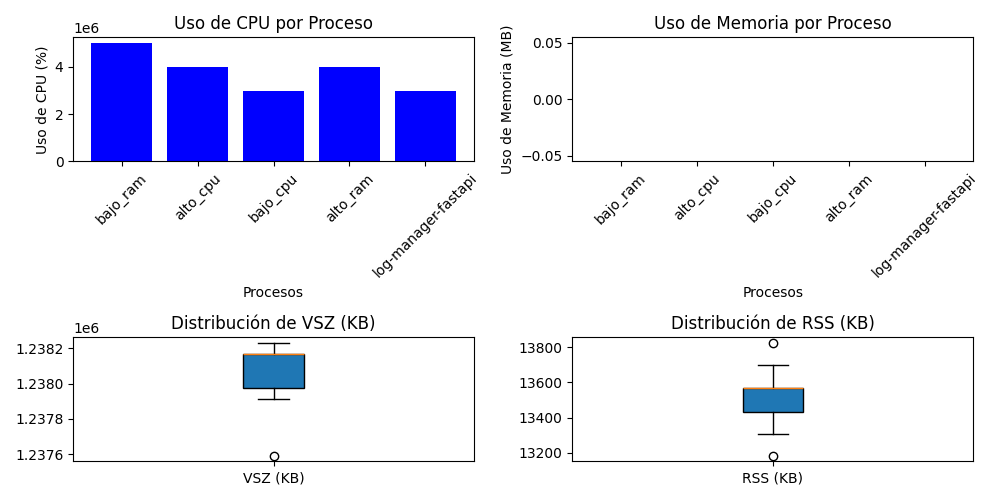

# PROYECTO 1


Objetivos:

Comprender el kernel de Linux a través de módulos C.
Utilice Rust para la gestión del sistema.
Comprender la gestión de contenedores Docker.
Automatiza procesos utilizando scripts bash.
Tareas principales:

Gestión de contenedores: cree scripts que generen contenedores Docker a intervalos regulares. Debería haber categorías distintas para contenedores de alto y bajo consumo de recursos.
Módulo Kernel: Capture y registre métricas de uso de memoria y procese información relacionada con los contenedores.
Servicio Rust: gestione el ciclo de vida de los contenedores, analice métricas y registre actividades. El servicio debe comunicarse con un contenedor de gestión de registros escrito en Python.

Requisitos técnicos:

Implementación de un trabajo cron para la creación de contenedores.
Almacenamiento de métricas y registros basado en JSON.
Uso de FastAPI en el contenedor de administración de registros para manejar solicitudes del servicio Rust.


# IMAGENES DE DOCKER 

Objetivo:

 Crear cuatro imágenes Docker (dos de alto consumo y dos de bajo consumo).
Contenedores de Alto Consumo:

Un contenedor debe consumir mucha CPU.
Otro debería consumir mucha RAM.

Contenedores de Bajo Consumo:

Ambos deberían tener un uso mínimo de CPU y RAM.

### [LINK A  -> IMAGEN DE BAJO RENDIMIENTO ](bajorendimientocpu/Dockerfile)

### [LINK A  -> IMAGEN DE ALTO RENDIMIENTO ](cpualtorendimiento/Dockerfile)


# CRON-JOB

De manera aleatoria deberá generar 10 contenedores

### [LINK A  -> BASH PARA CREAR LOS CONTENEDORES](creaciondecontenedores/contenedores.sh)


# MODULO KERNEL 

Captura las métricas de necesarias que el servicio necesitará para el análisis de la memoria y
contenedores.

### [LINK A  -> MODULO DE KERNEL ](ModuloKernel/sysinfo_module.c)

JSON OUTPUT DEL MODULO KERNEL EN LA CARPETA proc/sysinfo_201700633


 ```
{
"total_memory_kb": 7934100,
"free_memory_kb": 321040,
"used_memory_kb": 7613060,
"processes": [
   { "Cmdline": "/usr/bin/containerd-shim-runc-v2 -namespace moby -id eb6abad8623bcc65c361059d0338589cce5fe432d9951742525d1e1fe3f5089c -address /run/containerd/containerd.sock ",
"pid": 4841,
"name": "containerd-shim",
"vsz_kb": 1238168,
"rss_kb": 13468,
"Memoria_Utilizada": 0 ,
"Cpu_Utilizado": 3000000 
},
   { "Cmdline": "/usr/bin/containerd-shim-runc-v2 -namespace moby -id 163787e223ce3910e25f74a1cf11f4a68825d4d4d3768535593957e788e97926 -address /run/containerd/containerd.sock ",
"pid": 35826,
"name": "containerd-shim",
"vsz_kb": 1238168,
"rss_kb": 13820,
"Memoria_Utilizada": 0 ,
"Cpu_Utilizado": 2000000 
},
   { "Cmdline": "/usr/bin/containerd-shim-runc-v2 -namespace moby -id 1dcaf0369f6272f8ebacd157ac38914657bda121dffaa3689f56149bbbcae209 -address /run/containerd/containerd.sock ",
"pid": 36414,
"name": "containerd-shim",
"vsz_kb": 1238168,
"rss_kb": 13680,
"Memoria_Utilizada": 0 ,
"Cpu_Utilizado": 5000000 
},
   { "Cmdline": "/usr/bin/containerd-shim-runc-v2 -namespace moby -id da397c98f5cdcf669964050934a04b72ebf43b16b830e748e951e89efba1f081 -address /run/containerd/containerd.sock ",
"pid": 38669,
"name": "containerd-shim",
"vsz_kb": 1238168,
"rss_kb": 13652,
"Memoria_Utilizada": 0 ,
"Cpu_Utilizado": 6000000 
}
]
}
 ```

# SERVICIO DE RUST 

llevará la comunicación con diferentes partes y
funcionalidades. Por el manejo seguro de memoria y características únicas, se le has solicitado que
construya el gestor de contenedores en el lenguaje de programación Rust el cual estará encargado del
análisis, ejecución y comunicación de diferentes flujos durante toda la ejecución del servicio.

### [LINK A  -> SERVICIO DE RUST  ](ServicioRust/src/main.rs)

salida en consola de el servicio de rust

```
------------------------------
Información de la memoria:
Memoria total (kb): 7934100
Memoria libre (kb): 1393852
Memoria utilizada (kb): 6540248
------------------------------
Bajo consumo
PID: 35826, Name: alto_cpu, container ID: 163787e223ce3910e25f74a1cf11f4a68825d4d4d3768535593957e788e97926, Memory Usage: 0, CPU Usage: 2000000 , vsz_kb: 1238168 , rss_kb: 13656
PID: 4841, Name: alto_ram, container ID: eb6abad8623bcc65c361059d0338589cce5fe432d9951742525d1e1fe3f5089c, Memory Usage: 0, CPU Usage: 3000000 , vsz_kb: 1238168 , rss_kb: 13116
------------------------------
Alto consumo
PID: 50623, Name: log-manager-fastapi, container ID: c6992d1c3cde4031c4eb1d70f5d04def51484462955471cc92d1b415a7c4c12d, Memory Usage: 0, CPU Usage: 3000000, vsz_kb: 1237912 , rss_kb: 13564
PID: 36414, Name: alto_cpu, container ID: 1dcaf0369f6272f8ebacd157ac38914657bda121dffaa3689f56149bbbcae209, Memory Usage: 0, CPU Usage: 5000000, vsz_kb: 1238168 , rss_kb: 14032
PID: 38669, Name: bajo_cpu, container ID: da397c98f5cdcf669964050934a04b72ebf43b16b830e748e951e89efba1f081, Memory Usage: 0, CPU Usage: 6000000, vsz_kb: 1238168 , rss_kb: 13752
------------------------------
Log enviado exitosamente al contenedor de FastAPI
Contenedores matados
PID: 50623, Name: log-manager-fastapi, Container ID: c6992d1c3cde4031c4eb1d70f5d04def51484462955471cc92d1b415a7c4c12d, Memory Usage: 0, CPU Usage: 3000000, vsz_kb: 1237912, rss_kb: 13564
------------------------------
------------------------------
Información de la memoria:
Memoria total (kb): 7934100
Memoria libre (kb): 1416892
Memoria utilizada (kb): 6517208
------------------------------
Bajo consumo
PID: 35826, Name: alto_cpu, container ID: 163787e223ce3910e25f74a1cf11f4a68825d4d4d3768535593957e788e97926, Memory Usage: 0, CPU Usage: 2000000 , vsz_kb: 1238168 , rss_kb: 13656
PID: 4841, Name: alto_ram, container ID: eb6abad8623bcc65c361059d0338589cce5fe432d9951742525d1e1fe3f5089c, Memory Usage: 0, CPU Usage: 3000000 , vsz_kb: 1238168 , rss_kb: 13116
------------------------------
Alto consumo
PID: 50623, Name: log-manager-fastapi, container ID: c6992d1c3cde4031c4eb1d70f5d04def51484462955471cc92d1b415a7c4c12d, Memory Usage: 0, CPU Usage: 3000000, vsz_kb: 1237912 , rss_kb: 13564
PID: 36414, Name: alto_cpu, container ID: 1dcaf0369f6272f8ebacd157ac38914657bda121dffaa3689f56149bbbcae209, Memory Usage: 0, CPU Usage: 5000000, vsz_kb: 1238168 , rss_kb: 14032
PID: 38669, Name: bajo_cpu, container ID: da397c98f5cdcf669964050934a04b72ebf43b16b830e748e951e89efba1f081, Memory Usage: 0, CPU Usage: 6000000, vsz_kb: 1238168 , rss_kb: 13880
------------------------------
Log enviado exitosamente al contenedor de FastAPI
Contenedores matados
PID: 50623, Name: log-manager-fastapi, Container ID: c6992d1c3cde4031c4eb1d70f5d04def51484462955471cc92d1b415a7c4c12d, Memory Usage: 0, CPU Usage: 3000000, vsz_kb: 1237912, rss_kb: 13564
------------------------------
```

# Contenedor administrador de logs

crear un contenedor que actúe como
servidor en el lenguaje de programación Python y que tenga como finalidad, recibir las peticiones
generadas por el servicio de Rust y almacenar en formato JSON todos los registros generados y que
estos puedan ser accesibles tanto por la máquina host como por el contenedor con el uso de volúmenes.

### [LINK A  -> DOCKERFILE DE EL SERVIDOR DE PYTHON  ](ServidorDockerLogs/Dockerfile)
### [LINK A  -> LINK A EL SERVIDOR DE PYTHON ](ServidorDockerLogs/app.py)

### [LINK A  -> ARCHIVO DE LOGS ](img/logs.json)

## Gráficas con la información de los logs respectivos


