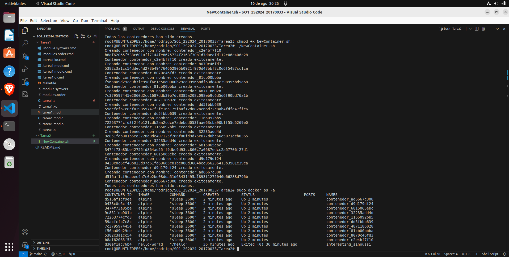

# CAPTURA DE CREACION DE LOS 10 CONTENEDORES




# CODIGO BASH PARA CREAR LAS IMAGENES 
 
 ```
 #!/bin/bash

# Verificar si Docker está instalado
if ! command -v docker &> /dev/null
then
    echo "Docker no está instalado."
    exit 1
fi

# Crear 10 contenedores con nombres aleatorios
for i in {1..10}
do
    # Generar un nombre aleatorio
    nombre_contenedor="contenedor_$(date +%s%N | sha256sum | head -c 10)"
    
    echo "Creando contenedor con nombre: $nombre_contenedor"
    
    # Crear el contenedor
    docker run -d --name "$nombre_contenedor" alpine sleep 3600
    
    # Verificar si el contenedor fue creado exitosamente
    if [ $? -eq 0 ]; then
        echo "Contenedor $nombre_contenedor creado exitosamente."
    else
        echo "Error al crear el contenedor $nombre_contenedor."
    fi
done

echo "Todos los contenedores han sido creados."

```

